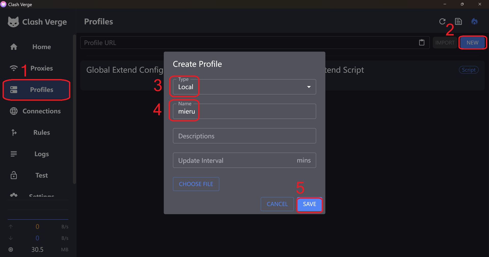
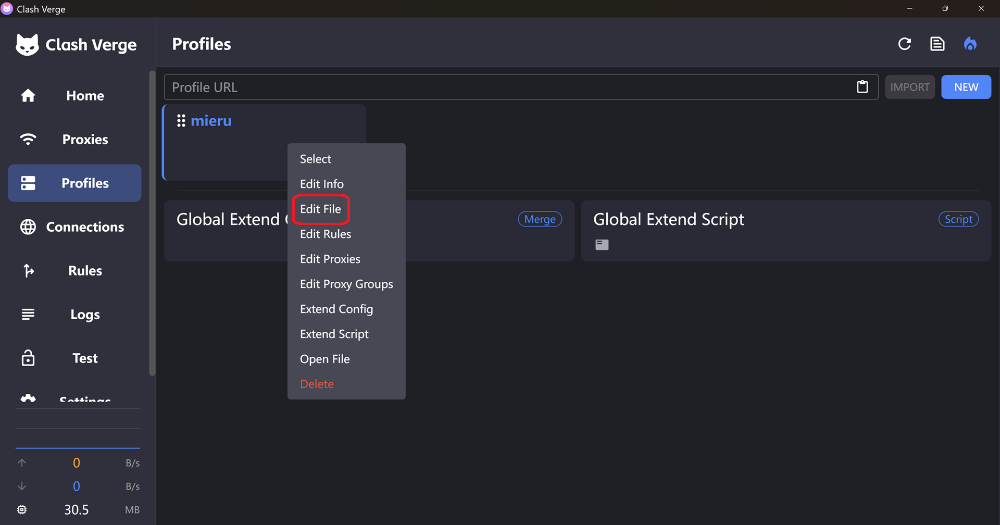
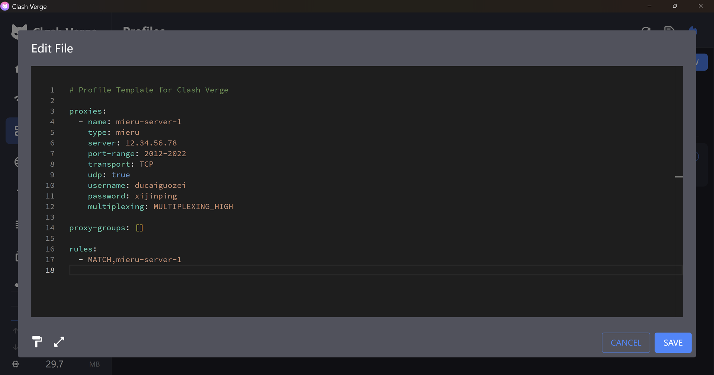
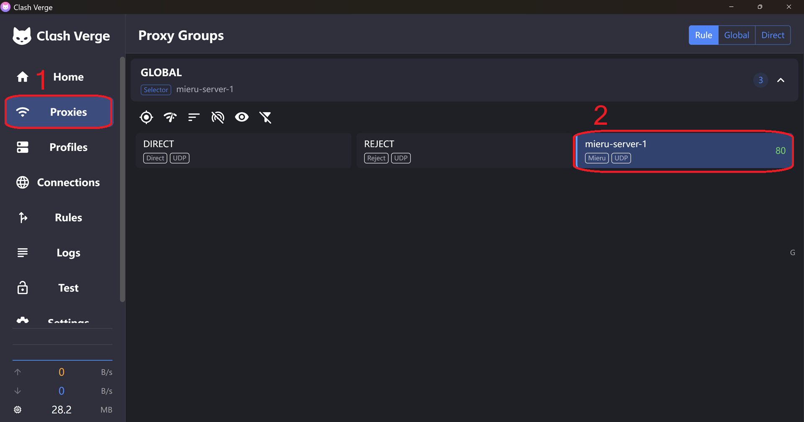

# Use mieru in Clash Verge Rev

First, create a new clash profile to store mieru configuration. Set `Type` to `Local`. You can use any profile name.

Once a new profile is created, right click the card, then click `Edit File` button.

In the text editor, enter mieru configuration.

[Click here](../client-install.md) to know detailed inforamtion about mieru configuration.

If you have multiple proxy servers, ports or port ranges, you can use `proxy-groups` to organize them. Set the rules to determine when traffic should be forwarded to mieru proxy servers.

After saving the mieru configuration, you can run a test to check the proxy delay.
